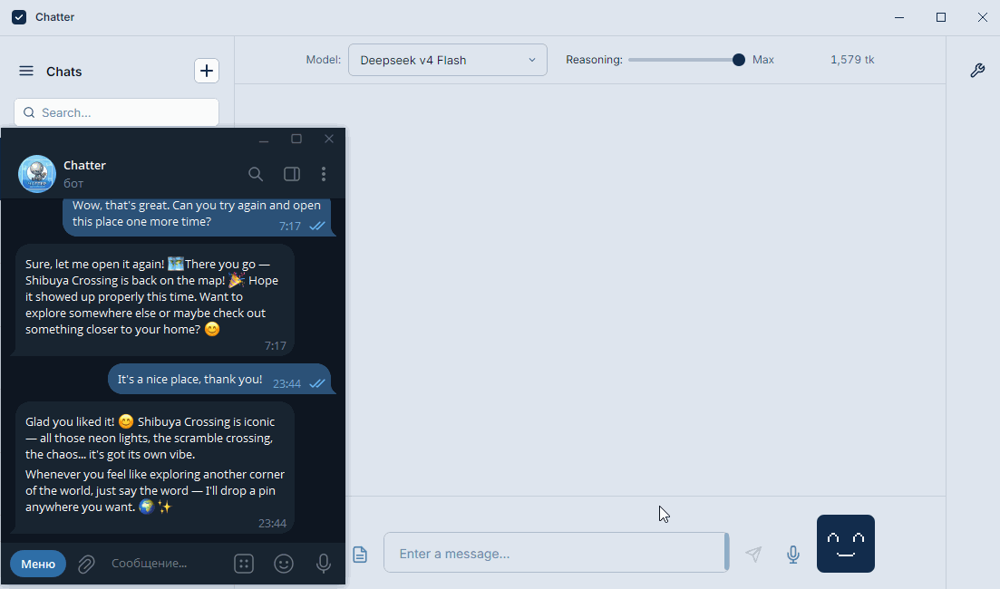
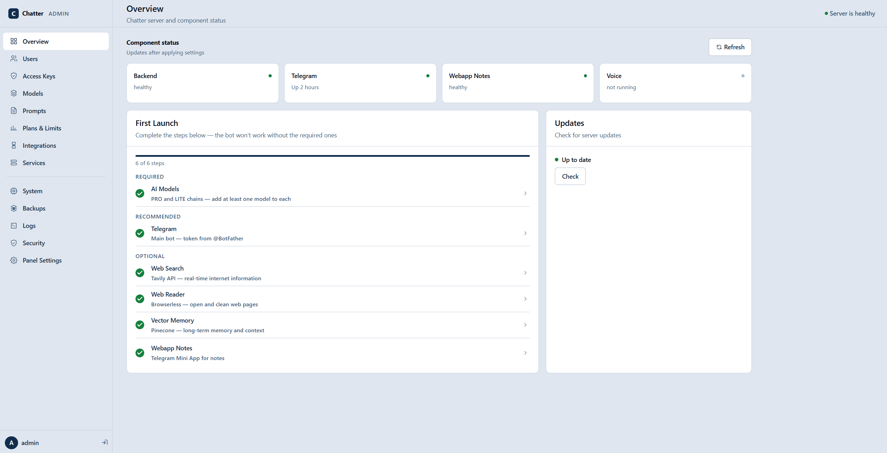
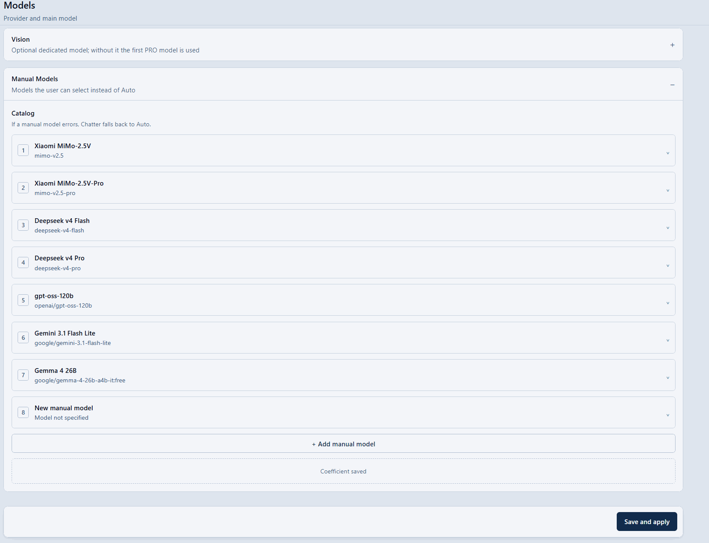
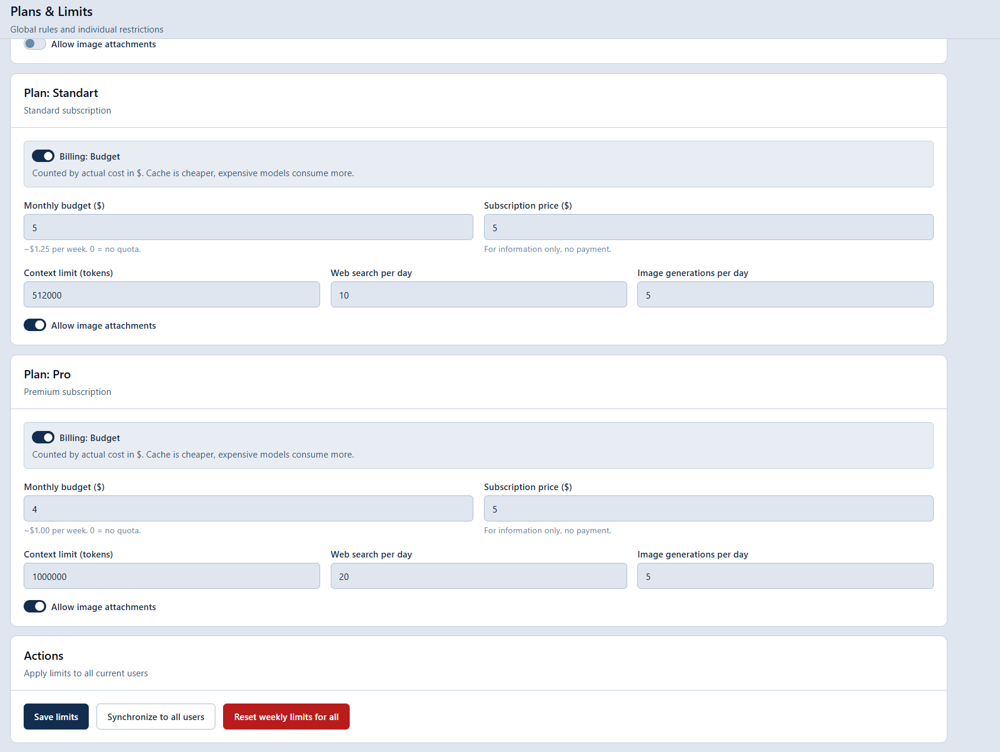
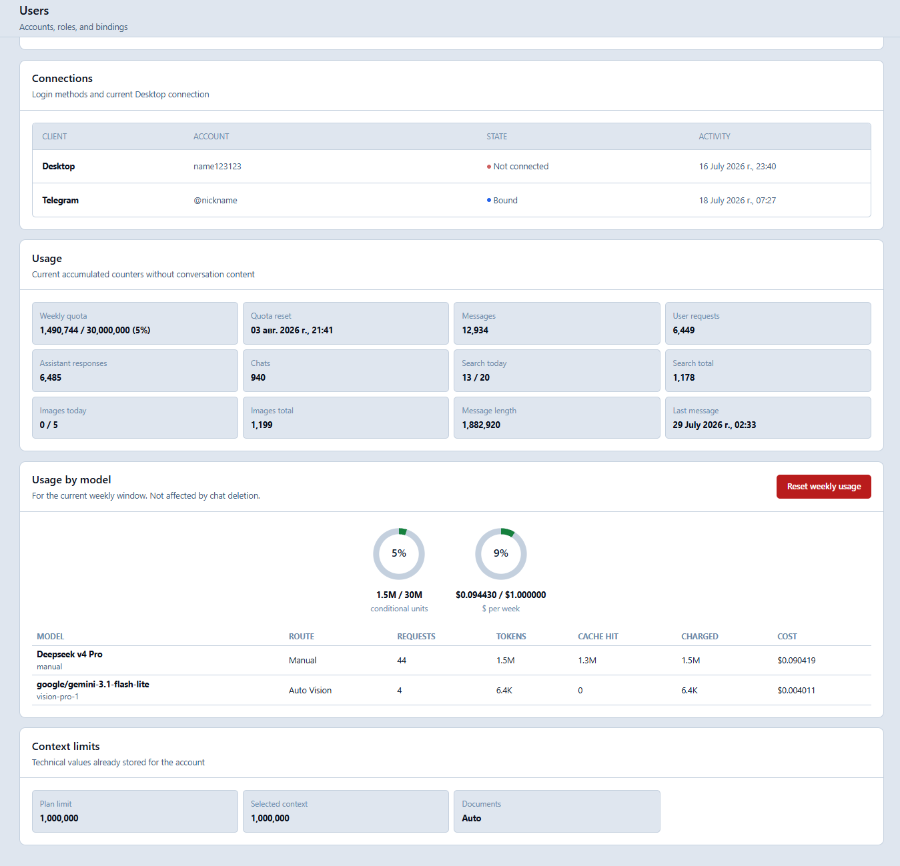
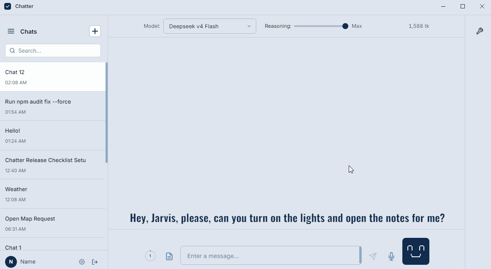
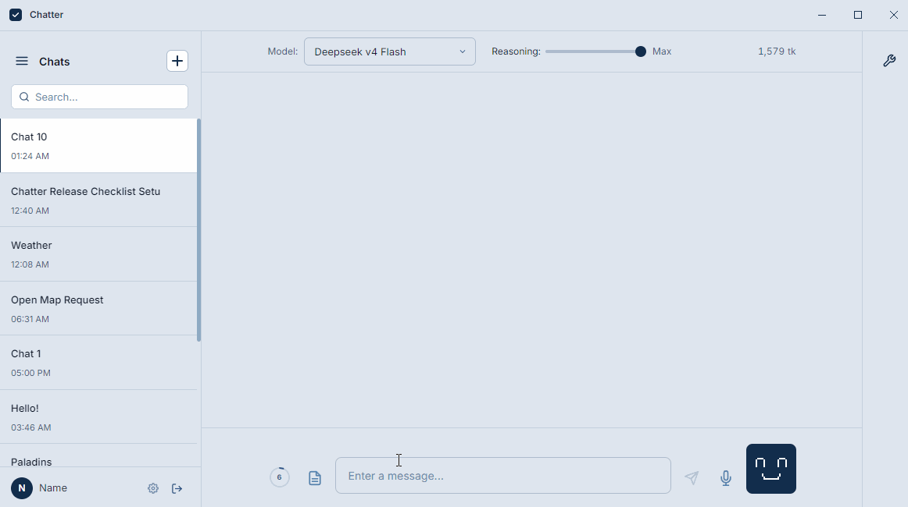
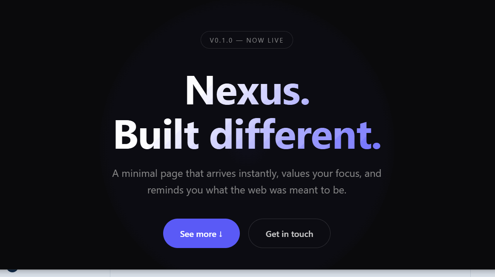
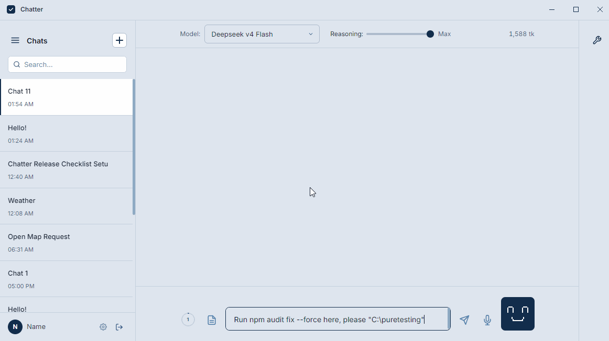

[English](../../README.MD) | [Русский](README_RU.MD) | [Deutsch](README_DE.MD) | [Español](README_ES.MD) | **Français** | [Italiano](README_IT.MD) | [日本語](README_JA.MD) | [한국어](README_KO.MD) | [Polski](README_PL.MD) | [Português (BR)](README_PT-BR.MD) | [中文（简体）](README_ZH-CN.MD) | [Türkçe](README_TR.MD) | [Čeština](README_CS.MD)

---

# Quest-ce que Chatter?

Chatter est un systeme multi-plateforme avec un agent IA qui fonctionne sur un serveur et peut etre partage avec des amis ou de la famille en un clic! Vous pouvez aussi deployer votre propre service avec des formules, des limites et une gestion pratique.

Les prix des modèles sont récupérés automatiquement depuis OpenRouter. Il ne vous reste qu’à définir un budget pour l’abonnement.

> **Le systeme de paiement nest pas encore integre!**



Vous vouliez partager lIA avec votre mere mais elle trouve la technologie trop compliquee? Donnez-lui votre bot Telegram. Zero courbe dapprentissage.

Vous vouliez votre propre Jarvis qui allume les lumieres, repond aux commandes vocales et baisse les stores la nuit? Apres avoir connecte lintegration domotique, Chatter peut le faire sans code supplementaire ni tokens gaspilles.

Ou peut-etre vouliez-vous simplement jouer un role avec un bot sans avoir a fouiller dans les configurations, lancer un serveur local et comprendre les parametres? Chatter a linterface la plus conviviale et un panneau dadministration pratique (autant que possible).

Lagent IA fonctionne sur le serveur (backend) et connecte Telegram et votre PC ensemble.

```
Telegram <-> Backend <-> Desktop
```

Un utilisateur Telegram peut continuer les memes conversations et controler son PC tant que le Bureau est connecte. La plupart des fonctionnalites sont disponibles independamment de lendroit ou le message a ete envoye.

---

## Comment le projet est-il structure?

- **backend-api** — toute la logique cote serveur de Chatter. Lagent, les outils, la memoire, les conversations, les limites, les utilisateurs et toute la logique partagee vivent ici.
- **desktop-app** — application Electron pour communiquer avec lagent et controler votre PC.
- **Telegram bot** — une deuxieme interface complete pour le meme compte, les memes conversations et fonctionnalites. Situe a la racine du projet (peu pratique, mais cest la que tout a commence).
- **admin-panel** — gestion des modeles, des cles, des utilisateurs, des limites, des sauvegardes et de letat du serveur.
- **chatter-manager** — connecte le panneau dadministration a Docker, vous permettant de demarrer, arreter et mettre a jour les composants.
- **webapp-notes** — mini-application Telegram pour les notes.
- **voice-service** — service optionnel réservé à Telegram : il transcrit les messages vocaux entrants et vocalise automatiquement la réponse de Chatter lorsque l’utilisateur envoie un message vocal.

Tous les composants serveur fonctionnent dans des conteneurs Docker separes et sont lies via Docker Compose. Vous pouvez donc garder uniquement ce dont vous avez reellement besoin.

---

## Comment installer?

1. Louez un serveur et assurez-vous dy installer fail2ban. Linstallateur configurera UFW automatiquement : il preservera laces au port SSH actuel du serveur et ouvrira les ports 80/443 pour Chatter.
2. Ouvrez une console et executez :
   ```bash
   curl -fsSL https://raw.githubusercontent.com/NikitaCherepov/chatter/main/install.sh | sudo bash
   ```
3. **ASSUREZ-VOUS** de sauvegarder le nom dutilisateur et le mot de passe affiches a la fin de linstallation.
4. Allez dans le panneau dadministration a ladresse de votre serveur et saisissez le nom dutilisateur et le mot de passe affiches dans la console.
5. Effectuez les etapes necessaires pour le premier demarrage :
   - Ajoutez un modele et une cle API pour le Auto mode.
   - Ajoutez un modele et une cle API pour le Lite mode.
   - Obtenez un token Telegram aupres de [BotFather](https://t.me/BotFather) et ajoutez-le au panneau.
   - Optionnellement, copiez le lien Webapp-Notes fourni dans le panneau et ajoutez-le a votre bot.
6. Envoyez un message au bot et approuvez votre profil via le panneau dadministration, puis accordez-vous les droits dadministrateur.

**Termine!**

---

## Comment connecter lapplication de Bureau?

1. Telechargez lapplication depuis Releases et installez-la. Windows peut vous avertir concernant labsence de signature numerique : la compilation nest actuellement pas signee avec un certificat.
2. Allez dans la section Cles daces au panneau dadministration.
3. Creez une nouvelle cle et collez-la dans lapplication de Bureau.
4. Inscrivez-vous.

**Termine!**

---

## Comment lier votre compte PC et Telegram ensemble?

1. Allez dans les parametres sur le bureau.
2. Selectionnez "Comptes lies".
3. Cliquez sur "Telegram".
4. Envoyez dans le bot Telegram : `/link`
5. Saisissez le code affiche a lecran.

**Termine!**

---

## Comment le partager avec un ami?

**Via Telegram:**
1. Envoyez-lui le bot Telegram et attendez quil vous ecrive.
2. Approuvez son compte depuis le panneau dadministration.

**Via le Bureau:**
1. Envoyez-lui lapplication de Bureau et partagez une Cle daces pour se connecter a votre serveur.

**Termine!**

Vous pouvez toujours voir si quelquun a partage votre cle, et vous pouvez la revoquer a tout moment.

---

## Que peut faire le panneau dadministration?



1. **Surveiller letat des composants** et les redemarrer.
2. **Vous voulez ajouter un nouveau modele?** Pas besoin de ressaisir une cle API sauvegardee ou de parcourir tout OpenRouter a la recherche dun nom de modele.
   - Les cles API peuvent etre sauvegardees et reutilisees.
   - Un moteur de recherche de modeles pour OpenRouter est integre au panneau dadministration.
   - La liste des fournisseurs est remplie automatiquement des que vous selectionnez un modele. Vous voulez que les requetes aillent uniquement vers un fournisseur specifique? Il suffit de le choisir dans le menu deroulant.
   - Les prix des tokens dentree/sortie/cache sont definis automatiquement lorsque vous selectionnez un modele.
   - Un modele Vision est disponible separement. Si le modele principal nest pas multimodal, il demandera a Vision de decrire limage que vous avez jointe.

   

3. **Gestion pratique des limites.**
   - Definissez simplement le budget quun utilisateur peut depenser.
   - Limites personnalisables pour les images et la recherche web pour tous les utilisateurs, ainsi que la possibilite de desactiver les pieces jointes images.

   

4. **Analyse** des modeles utilises par les utilisateurs, de la participation des sous-agents, de lefficacite du cache des messages et bien plus encore.

   

5. Journaux du backend et graphiques de performance du serveur.
6. Integration pratique des services disponibles. Collez une cle, saisissez les donnees, et tout fonctionne immediatement.
7. **Construction personnalisee:**
   - Vous ne voulez pas de la mini-application Telegram? Ne lactivez pas.
   - Pas de capacite pour la TTS cote serveur et la transcription vocale? Pas de probleme.
   - Vous pouvez configurer autant de invites predefinies pour vos utilisateurs que vous le souhaitez.
8. Besoin de bannir un utilisateur? Un clic, et il perd immediatement laces a votre serveur via Telegram et lapplication de Bureau. La cle daces peut egalement etre revoquee a tout moment.

---

## Que peut faire Chatter?

1. Utiliser la memoire vectorielle. Chaque utilisateur obtient un enregistrement isole separe par defaut. Actuellement, seule lintegration [Pinecone](https://app.pinecone.io/) est disponible.
2. Se reveiller sur "Alexa", "Hey, Jarvis", "Hey Mycroft" ou "Hey Rhasspy", avec prise en charge de la reconnaissance vocale et des reponses vocales.

   

3. Integre dans lapplication de Bureau :
   - modele local Piper pour la TTS;
   - modele natif Chrome TTS;
   - integration [Cartesia](https://www.cartesia.ai/).
4. Executer des commandes sur le PC, ainsi que modifier et lire des fichiers. Peut etre utilise comme CLI.

   

5. Lire et envoyer des e-mails depuis les boites aux lettres que vous avez ajoutees. Actuellement, une integration guidee pratique est disponible pour [Gmail](https://mail.google.com/mail/) et [Yandex](https://mail.yandex.ru/), ainsi que pour toute autre adresse e-mail que vous pouvez configurer manuellement. Lenvoi de-mails necessite la confirmation de lutilisateur.
6. Utiliser la recherche web via le service [Tavily](https://www.tavily.com/).
7. Lire et analyser des sites web avec [Browserless](https://www.browserless.io/pricing).
8. Generer des images a partir dune reference ou de texte via OpenRouter.
9. Utiliser des sous-agents pour nimporte quelle tache.

   

10. Invoquer des agents specialises. Par exemple : compresser et convertir des videos vers dautres formats.
11. Gerer vos serveurs. Le bot ne voit jamais votre cle SSH ni votre mot de passe sudo. Pour lexecution de commandes, une session SSH souvre directement sur votre serveur. La cle SSH peut etre recuperee en un bouton directement depuis votre ordinateur.
12. Sauvegarder et utiliser les instructions Runbook pour une utilisation ulterieure, et les partager avec dautres.
13. Sauvegarder des macros pour un controle dramatique (*Alexa, cest lheure de travailler!*).
14. Invites personnalisees, plus un editeur IA integre directement dans le panneau pour une edition pratique.
15. Definir des taches et des rappels. Par exemple : allumer la lumiere, vous rappeler de jeter les gouttes pour les yeux dans un mois, ou verifier le serveur (uniquement si les commandes sont dans la liste autorisee) pendant que vous dormez.
16. Controler votre avatar pixel et ajuster son humeur a la conversation directement sur lecran. Affichez egalement toutes les images et GIFs quil a trouves sur internet.
17. Creer du pixel art et lafficher directement sur lavatar pixel.
18. Sauvegarder les conversations au format DOCX, envoyer des messages dune conversation directement vers un compte Telegram lie, ainsi que de nombreuses autres fonctionnalites Quality of Life.
19. Vous aimez jouer un role avec des bots? Le **Dice Mode** est integre, lanant un d20 a chaque message que vous envoyez et influenant lhistoire!
20. Controler la carte integree dans linterface de lapplication, memoriser des points sur la carte et tracer des itinerairezs (mais verifiez les informations!).
21. Sauvegarder des notes dans votre carnet, egalement accessible depuis lapplication Telegram.
22. Configurer la taille du contexte, selectionner facilement les modeles pour les sous-agents sans toucher aux configurations, et definir les niveaux de raisonnement (actuellement disponibles pour les fournisseurs OpenRouter, DeepSeek et Xiaomi).
23. Controler la webcam, prendre des captures decran et cliquer sur lecran pendant que le Bureau est connecte. Chacune de ces actions necessite votre confirmation.
24. La plupart des fonctionnalites sont accessibles depuis Telegram avec un menu pratique et des boutons inline.
25. Controler votre maison intelligente et allumer les lumieres selon un horaire. Lintegration Yandex est disponible; le support Zigbee est actuellement experimental et necessite des tests supplementaires.
26. Joindre des documents et des photos meme a un modele sans vision (lorsquun modele de vision est configure separement).
27. Transcrire les messages vocaux de Telegram! (necessite un serveur puissant avec au moins 2 curs, 2 Go de RAM et voice-api active)
28. Creation pratique et rapide de branches de discussion, ainsi que regeneration avec instructions.
29. Le bot suggere une commande mais vous ne savez pas ce quelle fait? Appuyez sur le bouton Review et le modele Lite evalue ses risques.

---

## Sur quoi Chatter est-il concentre?

### 1. Operations sures de lagent

- Chaque action sur le serveur/PC nest autorisee quavec lapprobation de lutilisateur. Exceptions : Yolo mode active, Allow Always ou "travailler dans ce dossier". "Travailler dans ce dossier" trouve le `.git` le plus proche et le suggere comme valeur par defaut.
- Lagent ne voit jamais votre cle SSH ou votre mot de passe : ils sont substitutes automatiquement et stockes de maniere cryptee. **NE** donnez PAS votre mot de passe a lagent, meme sil le demande. Il dispose dune commande separee pour creer un nouvel utilisateur sur le serveur!
- Sur le bureau, vous pouvez desactiver selectivement des fonctionnalites pour plus de securite. Vous pouvez interdire lecriture de donnees tout en autorisant uniquement la lecture, desactiver les sous-agents, internet ou les commandes PC. Ou couper entierement son acces a votre memoire.
- Les e-mails, les cles SSH et les donnees sensibles sont cryptes.
- Toutes les requetes API du panneau dadministration passent par un proxy inverse et Chatter Manager, tandis que les tentatives de connexion repetees sont automatiquement bloquees.
- Une protection de base contre linjection de prompts est integree.
- Si vous ne savez pas ce que fait une commande suggeree par le reseau neuronal, vous appuyez sur Review et un autre reseau neuronal vous lexplique, en evaluant les risques.

   

### 2. Optimisation incessante

- Les invites systeme et autres parties repetees du contexte restent stables afin que le fournisseur puisse mettre en cache jusqua 90-95% des tokens dentree.
- Les conversations, photos et messages sont charges dynamiquement pour eviter de surcharger le DOM. La virtualisation nest pas utilisee (je la deteste) : a la place, un bouton "charger plus" et un calcul base sur le nombre de caracteres sont utilises.
- OpenRouter vous redirige vers differents fournisseurs et casse le cache, et vous navez pas envie de chercher et configurer des cles? Selectionnez simplement un fournisseur recupere directement depuis OpenRouter, et seul ce fournisseur sera utilise.
- Vous pouvez saisir plusieurs fournisseurs (OpenRouter/DeepSeek/Xiaomi/etc), et si le premier echoue avec une erreur, la tache est immediatement redirigee vers un autre.
- Pas dargent pour executer un modele de vision a chaque fois? Pas de probleme. Ajoutez un modele de vision une fois, et votre bot IA principal lui demandera simplement de decrire limage que vous avez jointe.
- Pas dargent pour la TTS mais vous en voulez quand meme? Des modeles locaux sont integres pour cela. De nombreuses integrations externes offrent egalement un niveau gratuit.
- Vous ne voulez pas que lIA genere du code utilitaire pour elle-meme encore et encore, brulant des tokens a chaque fois? Les outils integres de Chatter sont implementes dans le code a lavance. Cela semble etre un inconvenient, nest-ce pas? Mais ainsi vous pouvez travailler sur Chatter (si vous le souhaitez) parallelement aux abonnements aux grands services, en faisant simplement `git clone` sur votre ordinateur.
- Lapplication de Bureau en mode normal utilise environ 300 Mo de RAM et charge a peine le CPU. Les conteneurs serveur sont comptes separement, tandis que la TTS et Whisper necessitent naturellement plus de ressources. Meme Codex peut facilement ralentir et laguer sur ma machine.
- Pour eviter de casser le cache, lorsque le contexte deborde, 50% de la conversation est archivee (un resume concis pour la compression sera ajoute a lavenir).
- Si un document ne tient pas, Chatter reduit automatiquement son contenu, conservant jusqua 90% de la limite de contexte selectionnee.
- Un modele Lite dedie est utilise pour generer les titres de discussion, les evaluations et autres requetes legeres.

### 3. Praticite

- Vous voulez transferer des images ou des messages generes par lIA vers votre Telegram pour les avoir sur votre telephone? Appuyez sur un bouton.
- Vous voulez ameliorer une invite? Appuyez sur un bouton et appliquez les modifications suggerees par lIA.
- Vous ne voulez pas remplir des macros ou ecrire quelque chose dans le carnet? Demandez a lIA de le faire.
- Vous ne voulez pas chercher votre cle SSH sur tout votre PC? Appuyez sur un bouton :D
- Vous avez quitte la maison et voulez continuer la conversation depuis votre telephone? Toutes les conversations, la selection des invites et le choix du modele sont disponibles directement depuis Telegram!
- Vous ne voulez pas vous battre pour retrouver votre cle API, choisir un modele sur OpenRouter ou comprendre comment analyser le raisonnement dun nouveau modele? Les cles API peuvent etre sauvegardees, les modeles sont recuperes automatiquement et affichent immediatement le cout, les limites de contexte et les fournisseurs disponibles pour preserver le cache! Et DeepSeek et Xiaomi sont codes comme fournisseurs tiers (si de nouveaux comme Mistral apparaissent — ecrivez-moi, je les ajouterai).
- Vous ne voulez pas calculer manuellement le cout de chaque modele? OpenRouter remplit ses propres valeurs, et il existe des parametres predefinis pour les autres.
- Vos utilisateurs ne veulent pas se preoccuper du choix du modele? Le Auto mode est toujours la!
- Toutes les integrations recevront ulterieurement des descriptions et des guides de demarrage rapide. Ceux-ci existent deja pour lintegration domotique.

### 4. Personnalisation

- Les parametres de chaque modele peuvent etre configures. Temperature, Top P et autres.
- Les fonctionnalites de lapplication de Bureau peuvent etre desactivees et personnalisees.

---

## Traduire le projet dans votre langue

Vous avez decide de traduire le projet dans votre langue? Cest rapide et facile :

1. Ajoutez votre langue a `shared/languages.ts` — cest la source unique de verite pour la liste des langues dans tous les composants.
2. Executez :
   ```bash
   npm run sync:languages
   ```
   pour mettre a jour les copies locales de la liste.
3. Ajoutez votre cle API a `.env.i18n` :
   ```
   I18N_TRANSLATE_API_URL=url
   I18N_TRANSLATE_API_KEY=your_key
   I18N_TRANSLATE_MODEL=your_model
   ```
4. Executez :
   ```bash
   npm run i18n:translate:all
   ```
   Cette commande traduira separement les fichiers du bot Telegram, du Bureau, de lAPI Backend, de Webapp Notes, du panneau dadministration et du journal des modifications.
5. Profitez.

---

## Important

- Le service peut contenir des bugs que je nai pas encore trouves. Si vous en trouvez un — soumettez-le dans Issues, nous le resoudrons. Les bugs que je connais deja sont dans la liste dattente de corrections. Je travaille seul sur le projet, donc laide est la bienvenue!
- Les plans futurs incluent le refactoring de lapplication de bureau et de lAPI backend.
- Lors de lutilisation de Chatter comme CLI pour le travail, des problemes peuvent encore survenir (par exemple, il pourrait confondre une chaine et ne pas verifier les types, laissant une erreur). Je travaille a ameliorer cela.
- **Avis de securite:** Chatter est en cours de developpement actif et presente une surface dattaque importante en raison de ses integrations, de ses outils de controle a distance et de son architecture self-hosted. Bien que la securite soit une priorite, aucun logiciel ne peut etre garanti comme totalement sur. Verifiez la configuration avant dexposer une instance a Internet, maintenez-la a jour et signalez les vulnerabilites de maniere responsable. Le renforcement de la securite se poursuivra au fil de levolution du projet.
